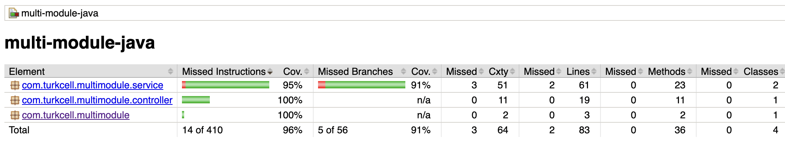
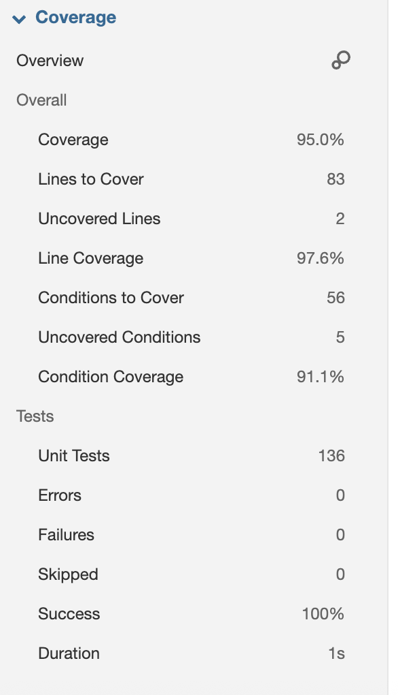
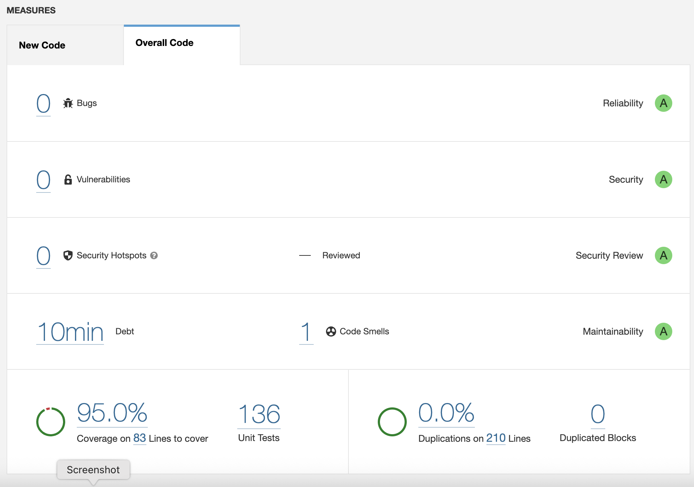

# Multi-Module Java Spring Boot Math API 🧮

[](https://openjdk.java.net/)
[](https://spring.io/projects/spring-boot)
[](https://maven.apache.org/)
[](https://www.sonarqube.org/)
[](https://www.jacoco.org/)

A RESTful API service for mathematical operations and geometry calculations developed with Spring Boot. The project is developed with SonarQube code quality analysis and JaCoCo test coverage reporting.

## 📋 Table of Contents

- [Features](#-features)
- [Technologies](#-technologies)
- [Installation](#-installation)
- [Usage](#-usage)
- [API Endpoints](#-api-endpoints)
- [Test Coverage](#-test-coverage)
- [SonarQube Integration](#-sonarqube-integration)
- [Project Structure](#-project-structure)
- [Contributing](#-contributing)

## 🚀 Features

- ✅ **Basic Math Operations**: Addition, subtraction, multiplication, division
- ✅ **Advanced Mathematics**: Power calculation, factorial computation
- ✅ **Geometry Calculations**: Circle area, rectangle area, distance between two points
- ✅ **RESTful API**: Modern REST API design
- ✅ **Comprehensive Test Coverage**: 80%+ line coverage, 70%+ branch coverage
- ✅ **SonarQube Integration**: Code quality analysis
- ✅ **JaCoCo Reports**: Detailed test coverage reports
- ✅ **Spring Boot DevTools**: Hot reload in development environment

## 🛠 Technologies

- **Java 21** - Latest LTS version
- **Spring Boot 3.2.5** - Web framework
- **Spring Web** - RESTful web services
- **Spring WebFlux** - Reactive programming
- **Spring Data REST** - REST repository
- **Maven** - Dependency management
- **JUnit 5** - Unit testing
- **JaCoCo** - Code coverage
- **SonarQube** - Code quality analysis

## 📦 Installation

### Requirements

- Java 21 or higher
- Maven 3.6 or higher
- SonarQube Server (optional, for code quality analysis)

### Steps

1. **Clone the project:**
```bash
git clone https://github.com/daemonctl/sonar-java-spring.git
cd multi-module-java
```

2. **Install dependencies:**
```bash
mvn clean install
```

3. **Run the application:**
```bash
mvn spring-boot:run
```

4. **Generate test coverage report:**
```bash
mvn clean test jacoco:report
```

The application will start running at `http://localhost:8080`.

## 🎯 Usage

You can test the API using the following endpoints in your browser or Postman:

```bash
# Addition operation
curl "http://localhost:8080/api/math/add?a=5&b=3"

# Multiplication operation
curl "http://localhost:8080/api/math/multiply?a=4&b=7"

# Circle area calculation
curl "http://localhost:8080/api/math/circle-area?radius=5"
```

## 🔗 API Endpoints

### Math Operations

| Method | Endpoint | Parameters | Description |
|--------|----------|------------|-------------|
| GET | `/api/math/add` | `a`, `b` | Adds two numbers |
| GET | `/api/math/subtract` | `a`, `b` | Subtracts two numbers |
| GET | `/api/math/multiply` | `a`, `b` | Multiplies two numbers |
| GET | `/api/math/divide` | `a`, `b` | Divides two numbers |
| GET | `/api/math/power` | `base`, `exponent` | Power calculation |
| GET | `/api/math/factorial` | `n` | Factorial calculation |

### Geometry Operations

| Method | Endpoint | Parameters | Description |
|--------|----------|------------|-------------|
| GET | `/api/math/circle-area` | `radius` | Circle area calculation |
| GET | `/api/math/rectangle-area` | `length`, `width` | Rectangle area |
| GET | `/api/math/distance` | `x1`, `y1`, `x2`, `y2` | Distance between two points |

### Example Usage

```bash
# Addition
GET /api/math/add?a=10&b=5
Response: 15.0

# Factorial
GET /api/math/factorial?n=5
Response: 120

# Circle area
GET /api/math/circle-area?radius=3
Response: 28.274333882308138

# Distance calculation
GET /api/math/distance?x1=0&y1=0&x2=3&y2=4
Response: 5.0
```

## 📊 Test Coverage

The project is developed with high test coverage targets:

- **Line Coverage**: Minimum 80%
- **Branch Coverage**: Minimum 70%

### Viewing Coverage Report

```bash
# Generate test and coverage report
mvn clean test jacoco:report

# View the report
open target/site/jacoco/index.html
```



## 🔍 SonarQube Integration

The project is configured to perform code quality analysis with SonarQube.

### Running SonarQube Analysis

1. **Start SonarQube server** (with Docker):
```bash
docker run -d --name sonarqube -p 9000:9000 sonarqube:latest
```

2. **Analyze the project**:
```bash
mvn clean verify sonar:sonar
```

3. **View results**: `http://localhost:9000`



### SonarQube Configuration

- **Project Key**: `java-spring-sonar`
- **Project Name**: `java-spring-sonar`
- **Code Coverage**: JaCoCo XML reports
- **Test Reports**: JUnit XML reports

## 📁 Project Structure

```
multi-module-java/
├── src/
│   ├── main/
│   │   ├── java/
│   │   │   └── com/turkcell/multimodule/
│   │   │       ├── MultiModuleJavaApplication.java
│   │   │       ├── controller/
│   │   │       │   └── MathController.java
│   │   │       └── service/
│   │   │           ├── Calculator.java
│   │   │           └── MathGeometry.java
│   │   └── resources/
│   │       └── application.properties
│   └── test/
│       └── java/
│           └── com/turkcell/multimodule/
│               ├── MultiModuleJavaApplicationTest.java
│               ├── controller/
│               │   └── MathControllerTest.java
│               └── service/
│                   ├── CalculatorTest.java
│                   └── MathGeometryTest.java
├── target/
├── image/
├── pom.xml
├── sonar-project.properties
└── README.md
```

### Class Descriptions

- **MultiModuleJavaApplication**: Spring Boot main class
- **MathController**: Controller managing REST API endpoints
- **Calculator**: Basic mathematical operations service
- **MathGeometry**: Geometry calculations service

## 🧪 Running Tests

```bash
# Run all tests
mvn test

# Run a specific test class
mvn test -Dtest=CalculatorTest

# Run tests with coverage
mvn clean test jacoco:report
```

## 🔧 Development

### Adding New Features

1. Add new method to service (`Calculator.java` or `MathGeometry.java`)
2. Add endpoint to controller (`MathController.java`)
3. Write unit tests
4. Check coverage
5. Run SonarQube analysis

### Code Quality Checks

- **Minimum Line Coverage**: 80%
- **Minimum Branch Coverage**: 70%
- **SonarQube Quality Gate**: Passed
- **No Code Smells**: Critical/Major issues

## 🤝 Contributing

1. Fork the project
2. Create feature branch (`git checkout -b feature/new-feature`)
3. Commit your changes (`git commit -am 'Add new feature'`)
4. Push the branch (`git push origin feature/new-feature`)
5. Create Pull Request

### Contribution Rules

- Code coverage should not fall below 80%
- All tests must pass
- SonarQube quality gate must pass
- Code should include English comment lines

## 📄 License

This project is licensed under the MIT License. See [LICENSE](LICENSE) file for details.

## 📞 Contact

- **Developer**: Korhan Herguner
- **Email**: [korhanherguner@gmail.com](mailto:korhanherguner@gmail.com)
- **LinkedIn**: [Korhan Herguner](https://www.linkedin.com/in/korhan-herguner/)
- **Project URL**: [https://github.com/daemonctl/sonar-java-spring](https://github.com/daemonctl/sonar-java-spring)

---

⭐ If you like this project, don't forget to give it a star!
